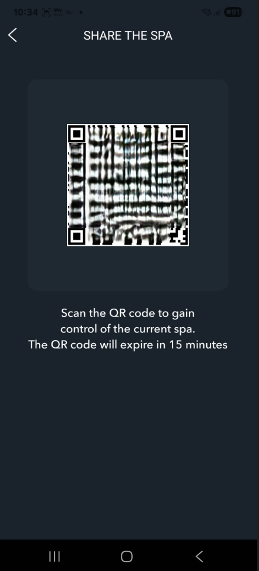
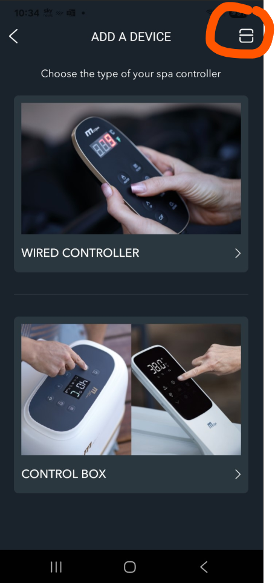

## Creating a Guest Account in the MSPA Link App

To use this integration securely, it is recommended to create a dedicated guest account in the MSPA Link app. This helps protect your main account credentials and allows for better access control.

### Steps to Create a Guest Account

1. **Open the MSPA Link App**  
   Launch the MSPA Link app on your mobile device and log in with your main account.

2. **Open the MSPA Link App with a guest account**  
   On a second mobile device download and install the MSPA Link app and log in with another account.
   You can create an account during the login process. The guest account must have a different
   email address from your main account.

3. **Navigate to "Share the Spa"**
    - On the device with your main user go to the device list and select your MSPA hot tub.
    - Tap the settings or options menu (usually represented by three dots or a gear icon).
    - Look for a section called **Share the Spa**.

4. **Invite a Guest User**
    - Tap **Share the Spa**. A QR code will be displayed on the screen.
 
      

    - The guest user / app should now click "add a new spa", and then click on the icon at the **top right** of the screen to scan the QR code.
    
      
 
    - Scan the QR code displayed on the main user device with the guest device.
    - Your MSPA hot tub will now be shared with the guest account and can be used with the Home Assistant integration.
    - Ensure that you log out of the guest account on the guest device to avoid any conflicts with the integration.

You can now use the guest account email and password in the Home Assistant integration configuration. This approach keeps your main account secure and allows you to revoke access at any time.